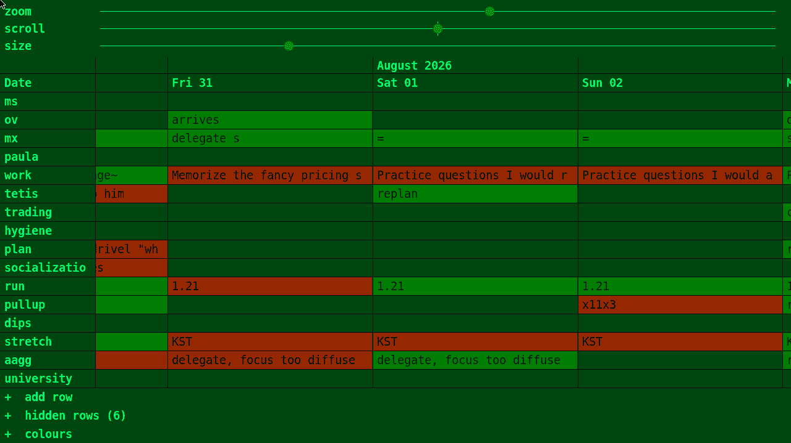

# TIMEGRID
An X11 desktop background time manager.

Zoom in/out with the scroll bar down to 5 minute precision.

You can add/remove rows arbitrarily.
alt + click - toggle the color of a task.
ctrl+drag - adjust a cell + cells to the right of it in time.

Easy custom themes.

# Rationale
Writing your 405th plan? Struggling to adhere to it?

Perhaps having it as your desktop background can help.

# Code quality
Mostly vibe-coded, with style guidelines in `agents.md` / `code_style.md` .

